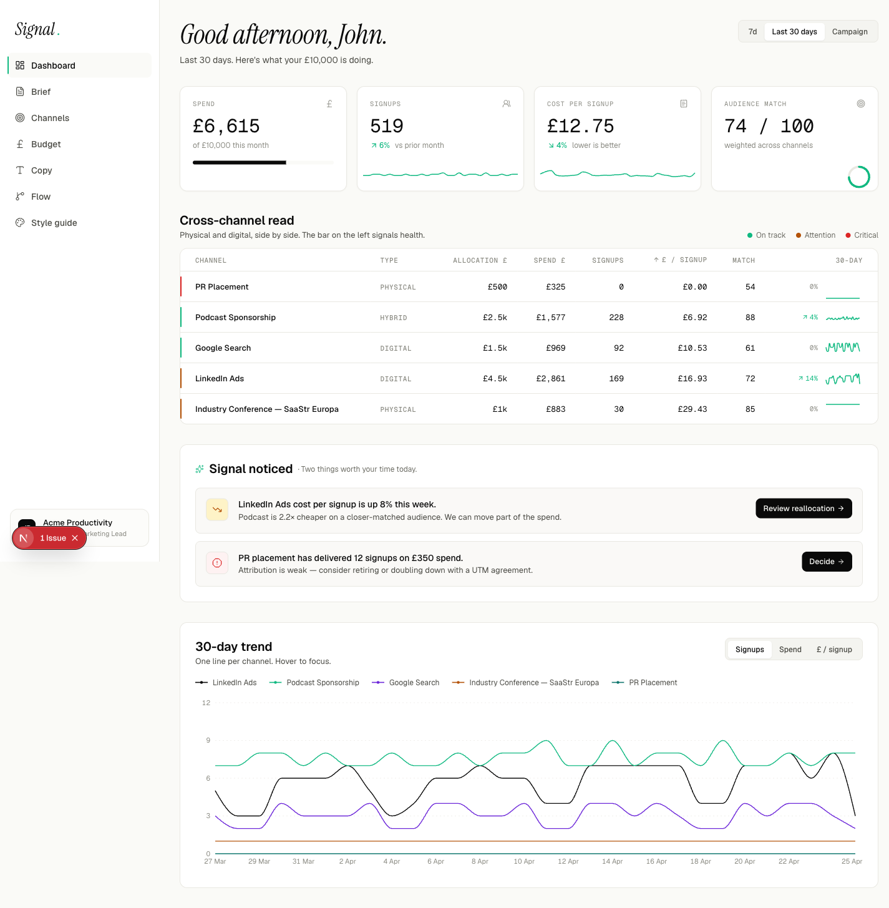
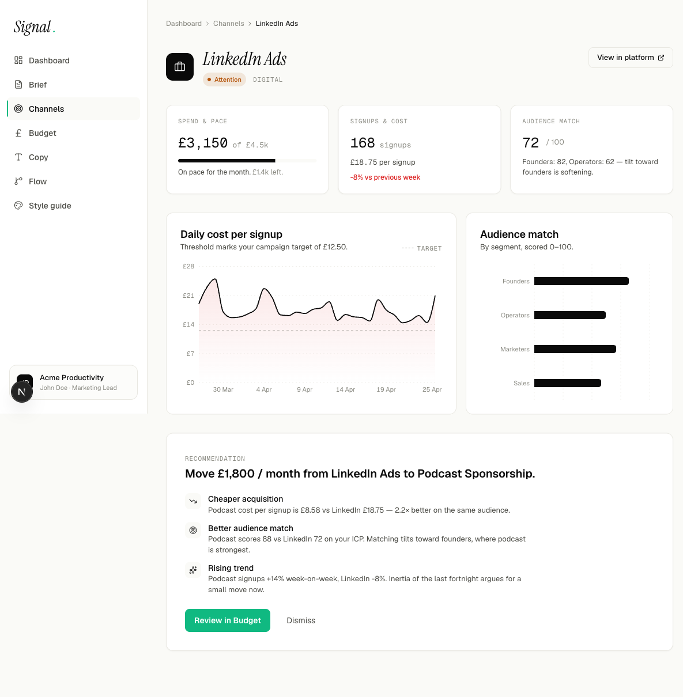
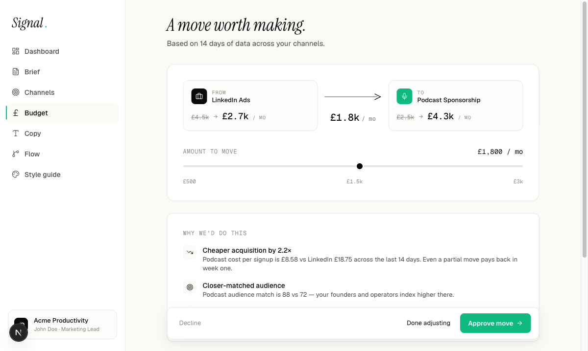
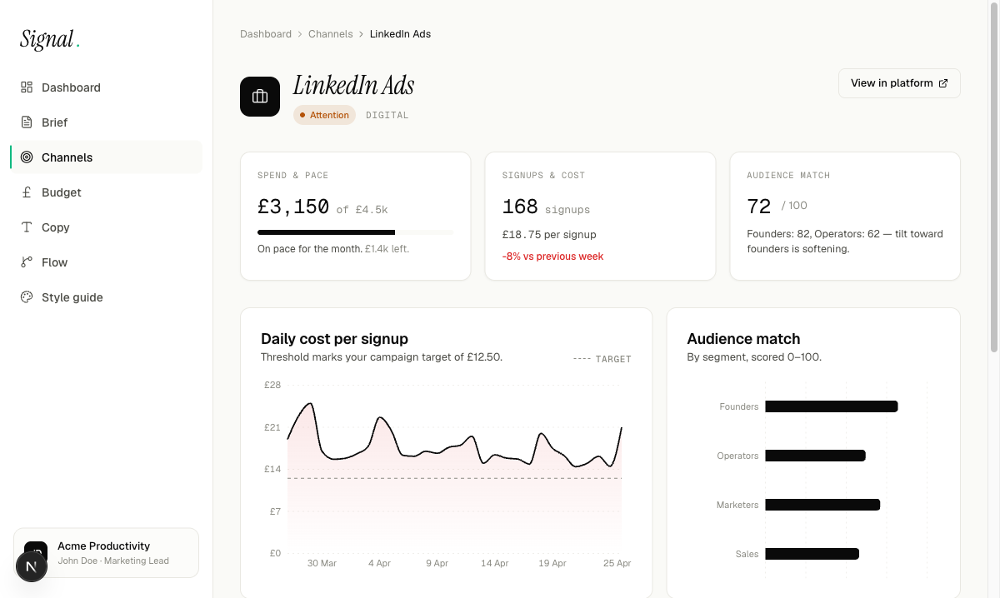

<div align="center">

<br/>

# Signal

### One dashboard, every channel, one clear read.

<sub>HCI Final Design Project · University of Birmingham Dubai · 2025–2026</sub><br/>
<sub>Group 16 — Visionary</sub>

<br/>

[**Live prototype →**](https://signal-drab-xi.vercel.app) &nbsp;·&nbsp; [**Final report (PDF) →**](submission/HCI_FinalDesign_Group16.pdf) &nbsp;·&nbsp; [**Pitch deck (PDF) →**](submission/pitch/Signal_Pitch_Deck.pdf)

<br/>



<sub><i>The dashboard. Five campaigns, four channels, one status read.</i></sub>

<br/><br/>

</div>

---

## Signal in one minute

Signal is a campaign-planning and measurement web app built for early-stage startup marketers — specifically for **John Doe**, a Dubai-based marketing lead with a £10k/month budget split across digital, paid social, events, and PR.

John doesn't have a dashboard. He has tabs. Five different reports, four different vocabularies, no single way to answer the question that wakes him at 2 a.m.: *which channel is working, and which one should I move money out of by Friday?*

Signal answers that question in one screen. A single status colour per channel, a multi-channel trend chart, and a budget reallocation flow that explains *why* before it asks for a click. The `/copy` route runs a Clarity Check against live ad copy via the Anthropic API and returns a verdict-and-suggestion pattern that rewards simpler messaging.

> **The hero feature** is the cross-channel dashboard. Everything else exists because that one screen needs supporting evidence to be trusted.

<br/>

## The brief, in plain language

This is the final coursework submission for **Human–Computer Interaction** under **Dr. Khalil ur Rehman Laghari**, taught at the University of Birmingham Dubai. The rubric awards 50 marks across:

| Deliverable | Marks | Where it lives |
|---|---|---|
| Final report — Stages 1–6 | 30 | [`submission/report/`](submission/report/) · also rendered in the [PDF](submission/HCI_FinalDesign_Group16.pdf) |
| Clickable prototype | 10 | [signal-drab-xi.vercel.app](https://signal-drab-xi.vercel.app) · plus `/style-guide` and `/flow` |
| Pitch deck | 10 | [`submission/pitch/Signal_Pitch_Deck.pdf`](submission/pitch/Signal_Pitch_Deck.pdf) |
| **Total** | **50** | |

Every stage of the process — from interviews to heuristic walkthroughs to the SUS score — sits in the [`submission/`](submission/) folder as both editable markdown and a typeset PDF, so the marker can verify any claim against the source.

<br/>

## Selected screens

<table>
  <tr>
    <td width="50%" valign="top">
      
      <br/><sub><b>Dashboard</b> — five campaigns, four channels, single status colour per channel, one trend chart for cross-channel comparison.</sub>
    </td>
    <td width="50%" valign="top">
      
      <br/><sub><b>Channel deep-dive</b> — per-channel performance, segmented by platform, with one specific recommendation grounded in the data.</sub>
    </td>
  </tr>
  <tr>
    <td width="50%" valign="top">
      
      <br/><sub><b>Budget reallocation</b> — the slider pulls money from underperforming channels into stronger ones; every move shows its evidence before it asks for confirmation.</sub>
    </td>
    <td width="50%" valign="top">
      
      <br/><sub><b>In-context confirmation</b> — destructive and irreversible actions surface a toast with an undo path, not a modal that interrupts thinking.</sub>
    </td>
  </tr>
</table>

<br/>

## How we got here — the six-stage arc

| Stage | What we did | Source |
|---|---|---|
| **1. Research** | Four semi-structured interviews with marketing professionals across role, seniority, and proximity to the problem space. | [`01_stage1_research.md`](submission/report/01_stage1_research.md) |
| **2. Competitive analysis & ideation** | Mapped six adjacent products against the four problem statements; ran a Crazy 8s round; converged via dot voting on impact × feasibility. | [`02_stage2_competitive_ideation.md`](submission/report/02_stage2_competitive_ideation.md) |
| **3. Prototype design** | Eight production routes built in Next.js 16 with Tailwind v4, shadcn/ui, Framer Motion, Recharts, and a real Anthropic-backed `/copy` endpoint. | [`03_stage3_prototype_design.md`](submission/report/03_stage3_prototype_design.md) |
| **4. Evaluation** | Five usability participants × four task scenarios, ten heuristic findings, **SUS = 84.5/100**. | [`04_stage4_evaluation.md`](submission/report/04_stage4_evaluation.md) · kit in [`materials/usability_test_kit.md`](submission/materials/usability_test_kit.md) |
| **5. Iteration** | Five evidence-driven fixes shipped to production — every commit traceable in this repository. | [`05_stage5_iteration.md`](submission/report/05_stage5_iteration.md) |
| **6. Reflection** | Five members, five voices, on what we learned about evidence, annotation, and the discipline of design. | [`06_stage6_reflection.md`](submission/report/06_stage6_reflection.md) |

For the executive read, the [final report PDF](submission/HCI_FinalDesign_Group16.pdf) folds all six stages into one document with cover, manifesto, references, and appendices.

<br/>

## The numbers

<table>
  <tr>
    <td align="center" width="20%"><b>4</b><br/><sub>Stage 1 interview<br/>participants</sub></td>
    <td align="center" width="20%"><b>5</b><br/><sub>Stage 4 usability<br/>participants</sub></td>
    <td align="center" width="20%"><b>10</b><br/><sub>Heuristic findings<br/>logged</sub></td>
    <td align="center" width="20%"><b>84.5</b><br/><sub>SUS score<br/>(out of 100)</sub></td>
    <td align="center" width="20%"><b>25</b><br/><sub>Commits in this<br/>repository</sub></td>
  </tr>
</table>

Every figure above is verifiable against the source markdown, the pitch deck, or the git log. Nothing in this repository is fabricated.

<br/>

## Tech stack

| Layer | Choice | Why |
|---|---|---|
| Framework | **Next.js 16** (App Router, Turbopack) | Server components for instant first paint; co-located route handlers for the Claude API call |
| Language | **TypeScript** (strict mode, no `any`) | Refactoring confidence on a five-person team |
| Styling | **Tailwind CSS v4** with `@theme` design tokens | Utility-first, design-system-friendly, zero CSS modules |
| Components | **shadcn/ui** (slate base) + custom Signal theme | Accessible primitives we control, not a black-box library |
| Motion | **Framer Motion** | Honours `prefers-reduced-motion`; spring config locked at the project level |
| Charts | **Recharts** | Composable, accessible, server-render-safe |
| Icons | **lucide-react** | Consistent, low-weight, no emoji decoration |
| Type | **Geist Sans / Mono** + **Instrument Serif** italic | Editorial weight on hero moments only |
| AI | **`@anthropic-ai/sdk`** for `/copy` | Real Claude call for the Message Clarity Check — not a mock |
| Hosting | **Vercel** | Preview URL per branch, env-scoped secrets |

Full design tokens, motion defaults, and copy conventions live in [`CLAUDE.md`](CLAUDE.md) at the repo root — the source of truth for any contributor.

<br/>

## Routes

| Route | Purpose |
|---|---|
| `/` | Redirect to `/dashboard` |
| `/dashboard` | The hero — unified cross-channel read |
| `/brief` | Four-step progressive form for new campaigns |
| `/channels` | Channel mix with rationale and live rebalance |
| `/channels/[id]` | Per-channel deep-dive with one specific recommendation |
| `/budget` | Single-decision budget reallocation, evidence first |
| `/copy` | Message Clarity Check — calls the Anthropic API live |
| `/flow` | First-class user-flow diagram |
| `/style-guide` | Internal design-token surface (a11y baseline check) |

<br/>

## Run it locally

```bash
git clone https://github.com/Kazemkhani/HCI-Final-Project.git
cd HCI-Final-Project
pnpm install
cp .env.local.example .env.local
# add your ANTHROPIC_API_KEY to .env.local — only needed for /copy
pnpm dev
```

Open [http://localhost:3000](http://localhost:3000). The `/copy` route returns a 500 with a friendly message if the key is absent; every other route runs without it.

```bash
pnpm build   # production build
pnpm lint    # ESLint, zero warnings expected
```

<br/>

## Repository map

```
HCI-Final-Project/
├── app/                       # Next.js 16 App Router routes
│   ├── api/clarity/           # /copy → Anthropic SDK call
│   ├── dashboard/             # the hero screen
│   ├── channels/, budget/, copy/, flow/, brief/, style-guide/
│   └── globals.css            # Tailwind v4 @theme tokens
├── components/                # shadcn/ui primitives + Signal additions
├── lib/                       # mock data, helpers, motion config
├── submission/                # everything the marker needs
│   ├── HCI_FinalDesign_Group16.{pdf,html,docx}   ← the deliverable
│   ├── report/                # markdown source for all six stages
│   ├── pitch/                 # pitch deck (md source + PDF render)
│   ├── materials/             # screenshots, heuristics, usability kit
│   ├── handover/              # internal sign-off doc
│   └── build_html.sh          # the rendering pipeline
├── BUILD.md                   # full build instructions
├── CLAUDE.md                  # design invariants — quiet, confident, evidence-led
└── README.md                  # you are here
```

<br/>

## The team — Group 16, Visionary

| | |
|---|---|
| Aquib Palampalliyali | Aman Riyas |
| Heng Cheng | Alagappan Alagappan |
| Amir Hossein Kazemkhani | |

Decision protocol: structured discussion first; if no consensus emerged within ten minutes, three dot votes per member on impact × feasibility — the same protocol that worked well in Assignment 2. Every reflection in Stage 6 is in the author's own voice; nothing was ghost-written across members.

<br/>

## Acknowledgements

- **Dr. Khalil ur Rehman Laghari** — module convenor, University of Birmingham Dubai, for the brief and the rigour it demanded.
- **Our four Stage 1 interview participants** and **five Stage 4 usability participants**, who gave their time anonymously and honestly.
- **The HCI cohort** for the heuristic walkthroughs and the brutal-but-fair feedback in critique sessions.

### On AI assistance

This project used AI tooling as a collaborator, never as an author. The `/copy` route ships a real Anthropic SDK call as part of the prototype; that is the user-facing AI. Outside the prototype, AI was used to accelerate research synthesis, draft scaffolding, and codebase scaffolding — every claim, design decision, and reflection was reviewed and ratified by a named team member before submission. The full provenance trail lives in this repository's commit history. See the AI Authorship & Use Statement in the front matter of the [final report](submission/HCI_FinalDesign_Group16.pdf).

<br/>

---

<div align="center">

<sub><b>Submitted 27 April 2026</b> · University of Birmingham Dubai · HCI 2025–2026</sub><br/>
<sub>Built with quiet confidence by Group 16.</sub>

</div>
